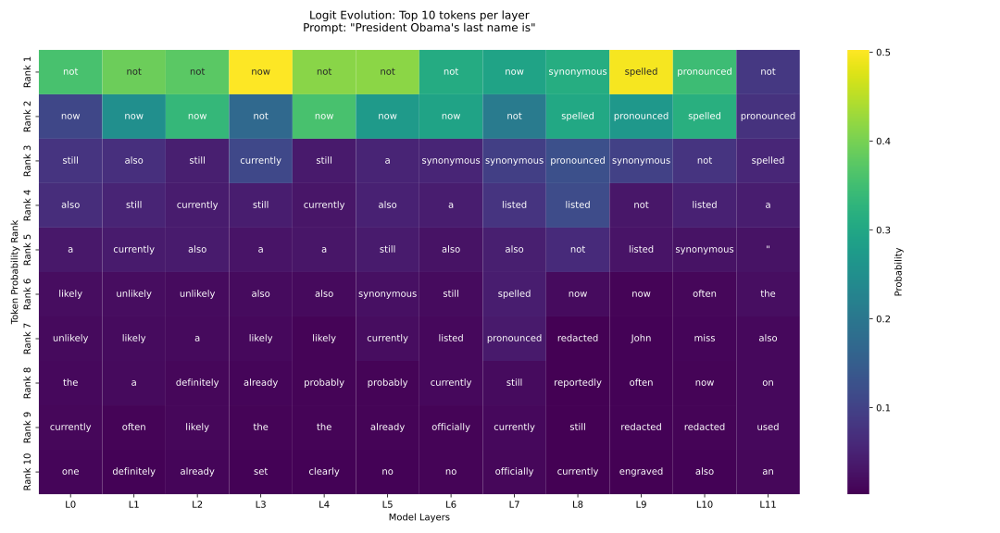

# Logit/Tuned Lens

Daniel Krawciw

## Intro

This small project has the following:
* Implementations of a Logit/Tuned Lens
* Nice Visualizations of the implementations
* Discussions on both the Logit and Tuned Lens

## Instructions

Run the following commands to initialize your environment:

```bash
uv sync
source .venv/bin/activate
```

Run `uv run src/logit.py` to generate a heatmap of the probabilities of the next token over each layer of a transformer using a logit lens.

Run `uv run src/tuned.py` to generate a heatmap of the probabilities of the next token over each layer of a transformer using a tuned lens.


## Output

The following is the Logit Lens evolution of the probabilities of the next generated token.



## Discussion

As we discussed in class, the logit lens is not incredibly helpful in understanding what is happening under the hood in a transformer. While this is true, I would say that it is interesting that there happens to be some coherence in what the next token should be. For example, when the prompt is: "The best state in the US is", the most probable token predicted in the first layer is: "not" which once could expect in a logical sentence. While I do not think there is much that this tells us about interpreting AI, I do think it is at the very least, interesting to see.